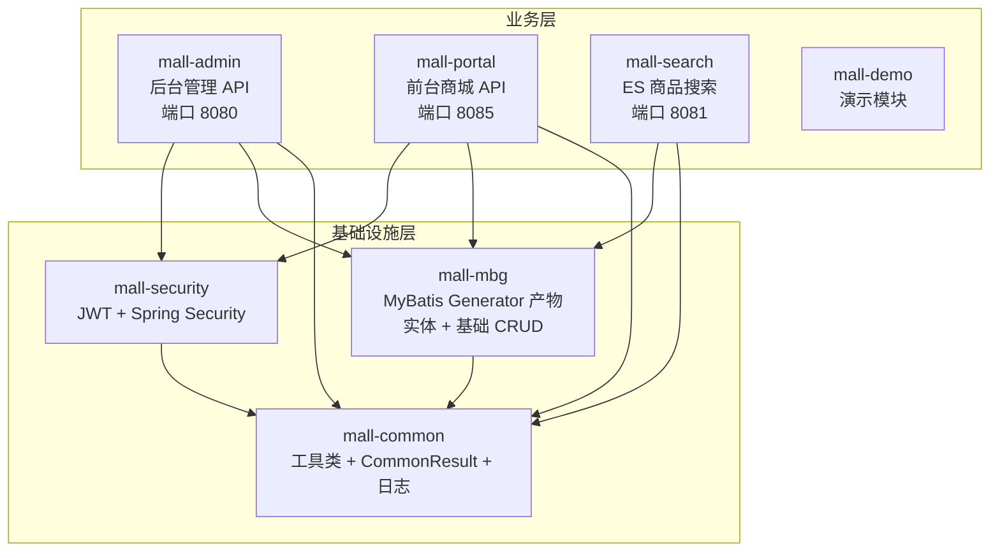
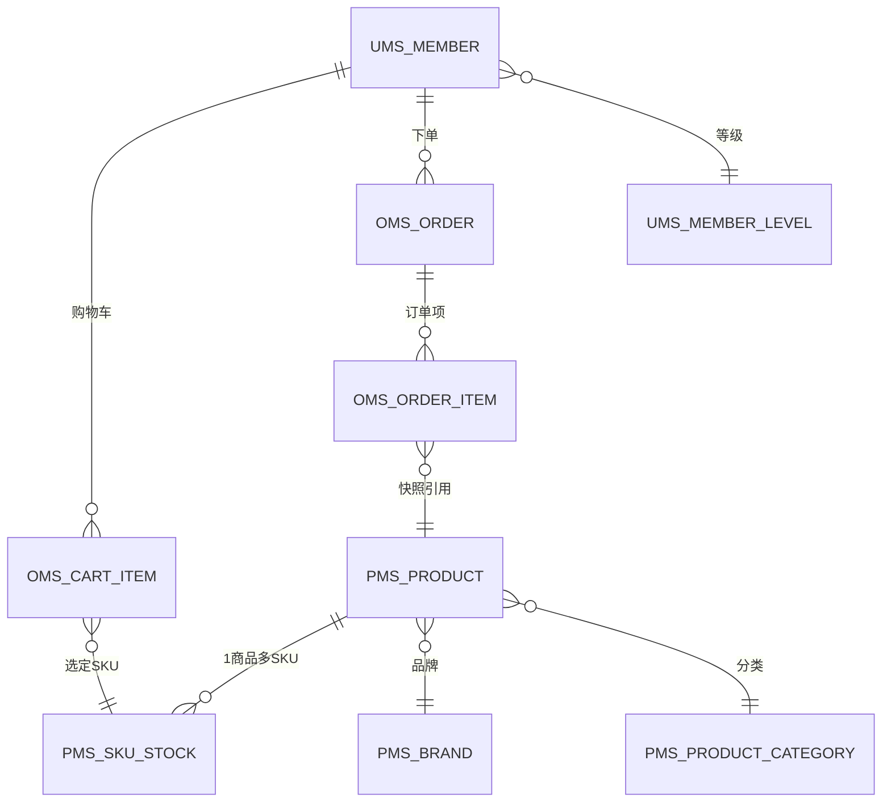
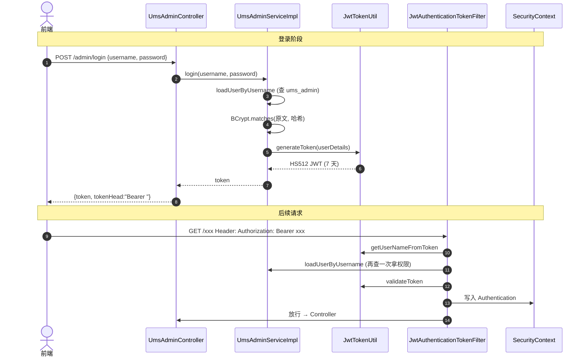
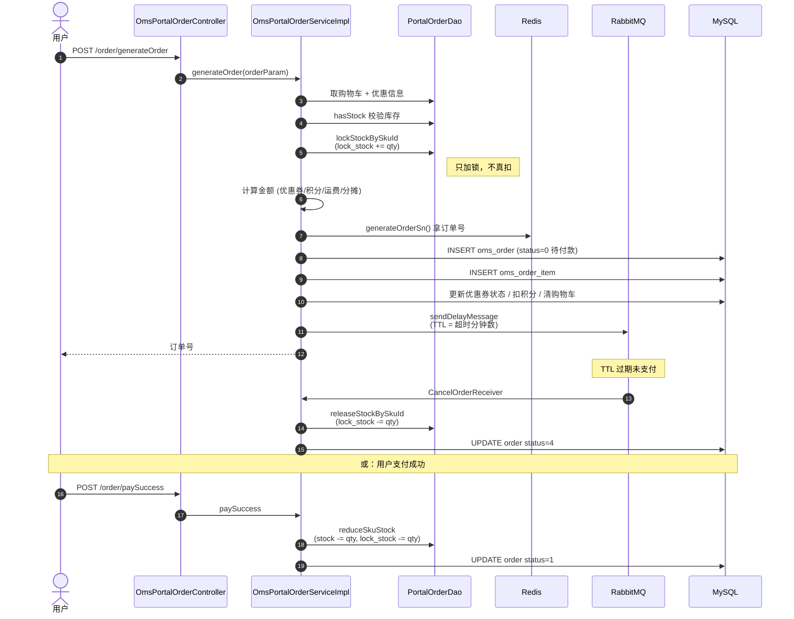

# mall 项目架构地图

> AI 辅助生成的速读文档。目标：让一个**不熟悉 Java 项目**的开发者在 30 分钟内建立对仓库的全局认知。
> 不替代源码阅读，但能让你知道**该读哪些类**、**它们怎么连起来**。

---

## 1. 模块依赖图

7 个 Maven 模块，分两层：基础设施层 + 业务层。父 `pom.xml` 锁定 Spring Boot 2.7.5、JDK 11。



**关键事实**：
- `mall-admin` 和 `mall-portal` 是两个独立可启动的 Spring Boot 应用，**不是微服务**——共享数据库的两个单体。
- `mall-mbg` 几乎都是自动生成代码（`mvn mybatis-generator:generate`），不要手改。
- 自定义 SQL 在 `mall-admin/src/main/resources/dao/*.xml`（不在 mall-mbg）。
- `mall-search` 独立用 Spring Data Elasticsearch，跟 MyBatis 那套并行。

---

## 2. 调用分层

```
HTTP 请求
   ↓
Controller (com.macro.mall.controller / portal.controller)
   ↓  参数校验 + Swagger 注解
Service (XxxService → XxxServiceImpl)
   ↓  业务逻辑 + @Transactional 边界
DAO (com.macro.mall.dao 自定义 / com.macro.mall.mapper MBG 生成)
   ↓
MySQL / Redis / RabbitMQ / ES
```

返回统一包装 `CommonResult<T>`（在 mall-common），格式 `{code, message, data}`。

---

## 3. 数据库领域模型

76 张表按前缀分 5 域。**记前缀就记住了一半架构**：

| 前缀 | 域 | 代表表 |
|------|---|--------|
| `pms_` | 商品 Product | product / sku_stock / product_category / brand |
| `oms_` | 订单 Order | order / order_item / cart_item / order_return_apply |
| `sms_` | 营销 Sales/Marketing | coupon / flash_promotion / home_advertise |
| `cms_` | 内容 Content | subject / topic / help |
| `ums_` | 用户 User | member / admin / role / resource / menu |

### 核心 ER（精简版）



### RBAC 体系（mall-admin 后台用）

```
ums_admin ⟷ ums_admin_role_relation ⟷ ums_role
                                          ⟷ ums_role_resource_relation ⟷ ums_resource (API 资源)
                                          ⟷ ums_role_menu_relation     ⟷ ums_menu     (前端菜单)
```

### 关键状态字段（必记）

| 表.字段 | 取值 |
|---|---|
| `oms_order.status` | 0=待付款 / 1=待发货 / 2=已发货 / 3=已完成 / 4=已关闭 / 5=无效 |
| `oms_order.pay_type` | 0=未支付 / 1=支付宝 / 2=微信 |
| `pms_product.publish_status` | 0=下架 / 1=上架 |
| `pms_product.verify_status` | 0=未审核 / 1=审核通过 |
| `pms_product.promotion_type` | 0=原价 / 1=促销价 / 2=会员价 / 3=阶梯价 / 4=满减 / 5=限时购 |

---

## 4. 关键流程一：后台登录 + JWT 鉴权



**关键类**（**精读这五个，鉴权就通了**）：

| 文件 | 作用 |
|---|---|
| `mall-admin/.../controller/UmsAdminController.java#login` | HTTP 入口 |
| `mall-admin/.../service/impl/UmsAdminServiceImpl.java#login` | 密码校验 + 发 Token |
| `mall-security/.../util/JwtTokenUtil.java` | JWT 编解码（HS512，7 天） |
| `mall-security/.../component/JwtAuthenticationTokenFilter.java` | 每请求过滤器 |
| `mall-security/.../config/SecurityConfig.java` | 白名单 + 过滤器链 |

**动态权限**：URL → 资源映射由 `DynamicSecurityMetadataSource` 从 `ums_resource` 加载（缓存到 Redis），`DynamicAccessDecisionManager` 决策。要加新接口的权限控制，去 `ums_resource` 表加记录即可，不用改代码。

---

## 5. 关键流程二：下单（mall-portal 最复杂的一条链）

入口 `OmsPortalOrderController#generateOrder`，核心实现在 `OmsPortalOrderServiceImpl#generateOrder`（约 150 行）。



**库存三态**（理解了这个就理解了电商的核心难点）：

| 操作 | SQL | 时机 |
|---|---|---|
| `lockStockBySkuId` | `lock_stock += qty` | 下单时（锁定） |
| `reduceSkuStock` | `stock -= qty; lock_stock -= qty` | 支付成功（真扣） |
| `releaseStockBySkuId` | `lock_stock -= qty` | 超时取消（释放） |

可售库存 = `stock - lock_stock`。

**延迟取消机制**（这是 RabbitMQ 在本项目里的核心用法）：
- TTL 队列 `mall.order.cancel.ttl` + 死信交换机 → 主队列 `mall.order.cancel`
- 下单时把订单 ID 投到 TTL 队列，过期未消费就被死信转发到主队列，监听器触发取消逻辑
- 超时时间从 `oms_order_setting.normal_order_overtime` 读取

---

## 6. 配置和中间件

| 中间件 | 用途 | 在代码里的位置 |
|---|---|---|
| MySQL | 主存储 | `application-dev.yml` 数据源 |
| Redis | Token 黑名单 / 订单号生成 / 验证码 / 资源-角色映射缓存 | `RedisService` |
| RabbitMQ | 订单延迟取消 | `RabbitMqConfig` + `CancelOrder*` 组件 |
| Elasticsearch | 商品搜索 | `mall-search` 整个模块 |
| MongoDB | 商品浏览历史 | mall-portal 下 MemberReadHistory |
| MinIO / 阿里云 OSS | 商品图片 / 上传文件 | `MinioController` / `OssController` |

配置文件入口：`application.yml`（基础） + `application-dev.yml`（本地开发）。JWT 密钥 `jwt.secret: mall-admin-secret` 在 yml 里——**生产环境必须移到环境变量**。

---

## 7. 给阅读者的建议读图顺序

1. **先看本文档** + Swagger（http://localhost:8080/swagger-ui/）建立 API 体感
2. **跑通登录**：UmsAdminController#login → ServiceImpl#login → JwtTokenUtil → JwtAuthenticationTokenFilter（这五个文件按顺序读一遍，鉴权就懂了）
3. **跑通下单**：OmsPortalOrderController#generateOrder → ServiceImpl#generateOrder → PortalOrderDao.xml（库存三个 SQL）→ RabbitMqConfig（延迟队列）
4. **其他模块按需查阅**，不必通读

**不建议读**：所有 `mall-mbg` 下的代码（自动生成的、机械化的 CRUD），以及 `*Example.java`（MBG 的查询条件 DSL，写法老旧）。

---

## 8. 2026 视角下的"过时点"提示

读到下列模式时，知道**这不是 2026 该学的写法**：

- `@Autowired` 字段注入 → 应改构造器注入
- Springfox `@ApiOperation`/`@ApiImplicitParam` → springdoc-openapi 的 `@Operation`/`@Parameter`
- MBG 生成的 `XxxExample.createCriteria()` 链式查询 → MyBatis-Plus QueryWrapper 或 JOOQ
- JJWT 0.9.1 老 API（`Jwts.parser().setSigningKey()`） → JJWT 0.12+ 用 `Jwts.parser().verifyWith()`
- `application-dev.yml` 里的明文密钥 → 环境变量 / Vault
- 没有 Testcontainers、没有 CI、`skipTests=true`
- 没有 Micrometer / OpenTelemetry 接入

把"读懂老写法 + 知道现代写法"作为产出，比"模仿老写法"更有价值。
